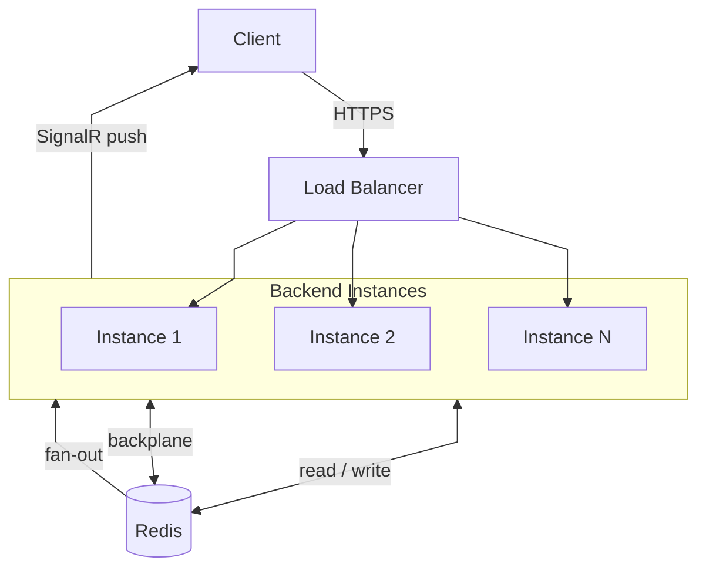
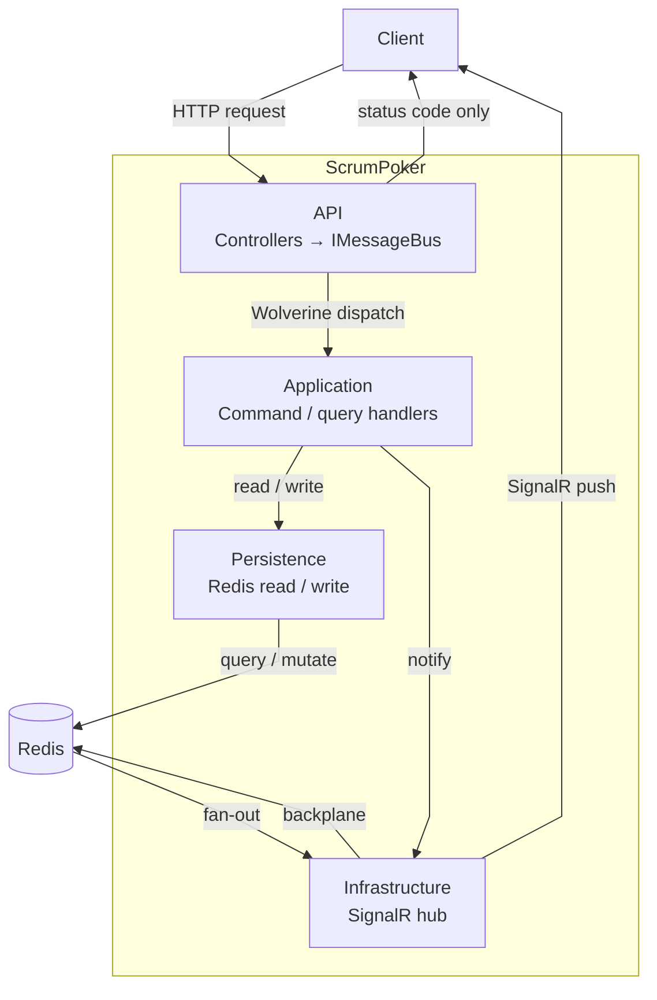

# Design

## High Level Design

```mermaid
%%{init: {'flowchart': {'curve': 'linear'}}}%%
flowchart TD
    Client

    Client -->|HTTPS| LB[Load Balancer]

    LB --> API1 & API2 & APIN

    subgraph Instances["Backend Instances"]
        API1["Instance 1"]
        API2["Instance 2"]
        APIN["Instance N"]
    end

    Instances <-->|read / write| Redis[(Redis)]
    Instances <-->|backplane| Redis
    Redis -->|fan-out| Instances
    Instances -->|SignalR push| Client
```

## Low Level Design

```mermaid
%%{init: {'flowchart': {'curve': 'linear'}}}%%
flowchart TD
    Client

    Client -->|HTTP request| API
    API -->|status code only| Client

    API -->|Wolverine dispatch| Application

    Application -->|read / write| Persistence
    Application -->|notify| Infrastructure

    Persistence -->|query / mutate| Redis[(Redis)]
    Infrastructure -->|backplane| Redis
    Redis -->|fan-out| Infrastructure
    Infrastructure -->|SignalR push| Client

    subgraph ScrumPoker
        API["API\nControllers → IMessageBus"]
        Application["Application\nCommand / query handlers"]
        Persistence["Persistence\nRedis read / write"]
        Infrastructure["Infrastructure\nSignalR hub"]
    end
```
