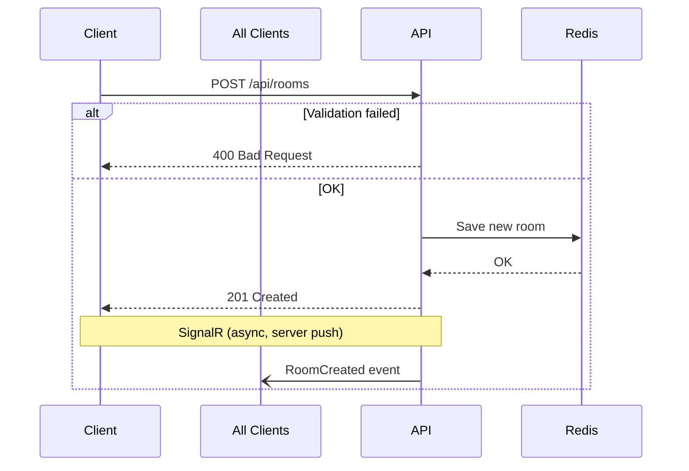
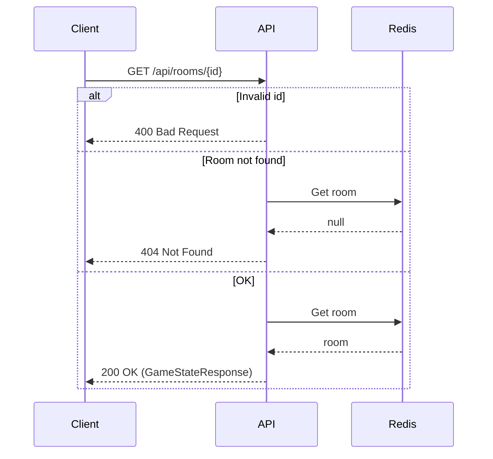
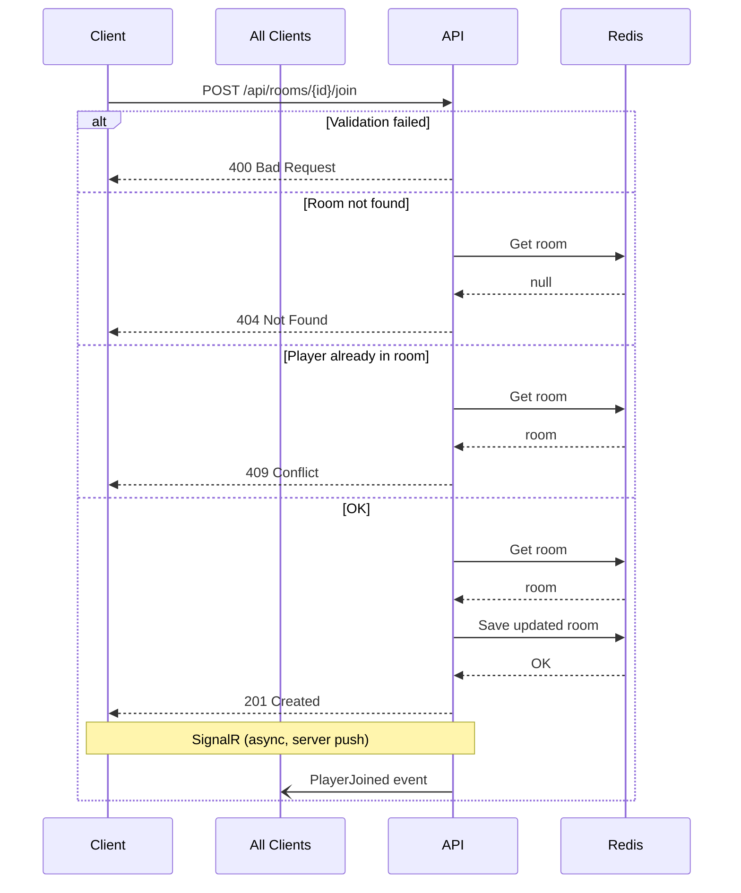
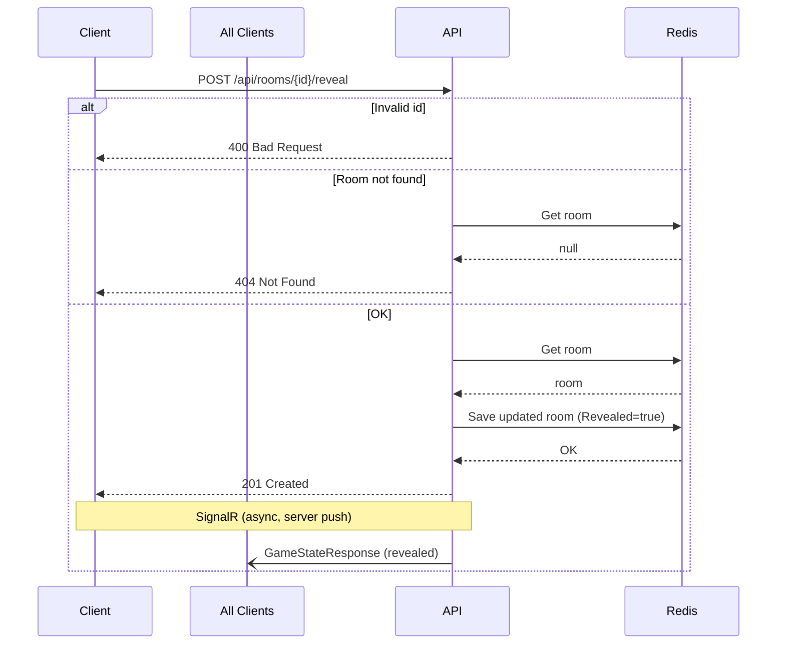
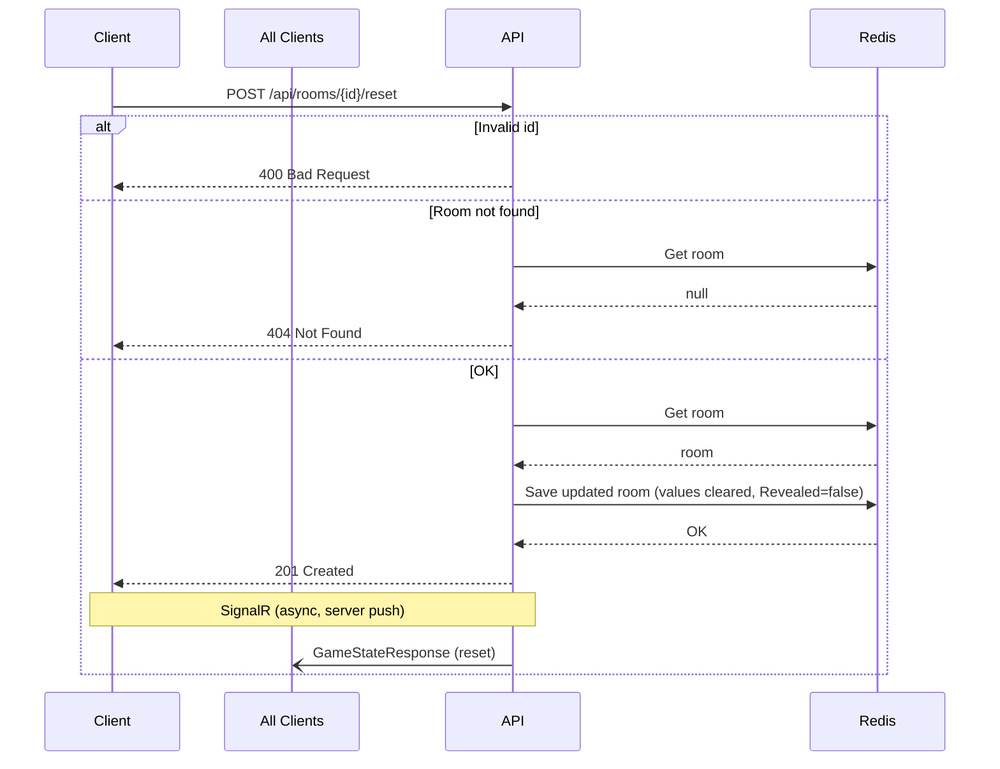

# Endpoints

All POST endpoints return status code only — no response body. SignalR pushes full game state after every action.

## Create Room

`POST /api/rooms`

Creates a new scrum poker room and adds the creator as the first player.

### Sequence



### PlayerName (body)

| Field | Type | Required | Rules |
|-------|------|----------|-------|
| PlayerName | string | yes | max 50 chars |

| Status Code | Description |
|-------------|-------------|
| 201 | Room created. `Location` header contains room URL. |
| 400 | Validation failed |

---

## Get Game State

`GET /api/rooms/{id}`

Returns the current game state. Only GET endpoint that returns a response body.

### Sequence



### id (path)

| Field | Type | Required | Rules |
|-------|------|----------|-------|
| id | int | yes | must be > 0 |

### Response (200 OK)

```json
{
  "gameId": 1234,
  "players": [
    { "name": "Alice", "value": "5" },
    { "name": "Bob", "value": null }
  ],
  "revealed": false
}
```

| Status Code | Description |
|-------------|-------------|
| 200 | Room found |
| 400 | Invalid id |
| 404 | Room not found |

---

## Join Room

`POST /api/rooms/{id}/join`

Joins an existing room as a player.

### Sequence



### id (path)

| Field | Type | Required | Rules |
|-------|------|----------|-------|
| id | int | yes | must be > 0 |

### PlayerName (body)

| Field | Type | Required | Rules |
|-------|------|----------|-------|
| PlayerName | string | yes | max 50 chars |

| Status Code | Description |
|-------------|-------------|
| 201 | Joined successfully |
| 400 | Validation failed |
| 404 | Room not found |
| 409 | Player already in room |

---

## Vote

`POST /api/rooms/{id}/vote`

Casts a vote for the current round.

### Sequence


### id (path)

| Field | Type | Required | Rules |
|-------|------|----------|-------|
| id | int | yes | must be > 0 |

### VoteRequest (body)

| Field | Type | Required | Rules |
|-------|------|----------|-------|
| PlayerName | string | yes | max 50 chars |
| Value | string | yes | must be one of: `0, 0.5, 1, 2, 3, 5, 8, 13, 21, ?` |

| Status Code | Description |
|-------------|-------------|
| 201 | Vote recorded. If all players have voted, `Revealed` is automatically set to `true`. |
| 400 | Validation failed |
| 404 | Room not found or player not in room |

---

## Reveal Votes

`POST /api/rooms/{id}/reveal`

Reveals all votes in the current round.

### Sequence



### id (path)

| Field | Type | Required | Rules |
|-------|------|----------|-------|
| id | int | yes | must be > 0 |

| Status Code | Description |
|-------------|-------------|
| 201 | Votes revealed |
| 400 | Invalid id |
| 404 | Room not found |

---

## Reset Votes

`POST /api/rooms/{id}/reset`

Resets all votes for the next round.

### Sequence



### id (path)

| Field | Type | Required | Rules |
|-------|------|----------|-------|
| id | int | yes | must be > 0 |

| Status Code | Description |
|-------------|-------------|
| 201 | Votes reset |
| 400 | Invalid id |
| 404 | Room not found |

---

## SignalR Hub

`/api/hub`

### Client → Server

| Method | Parameter | Description |
|--------|-----------|-------------|
| JoinRoom | string roomId | Add connection to room group |
| LeaveRoom | string roomId | Remove connection from room group |

### Server → Client Events

| Event | Payload | Triggered by |
|-------|---------|-------------|
| RoomCreated | `{ RoomId, PlayerName }` | POST /api/rooms |
| PlayerJoined | `{ RoomId, PlayerName }` | POST /api/rooms/{id}/join |
| VoteCast | `{ RoomId, PlayerName, Value }` | POST /api/rooms/{id}/vote |

---

## Health Checks

| Route | Purpose |
|-------|---------|
| GET /health | Ready probe (all checks must pass) |
| GET /alive | Liveness probe (tagged "live" only) |
