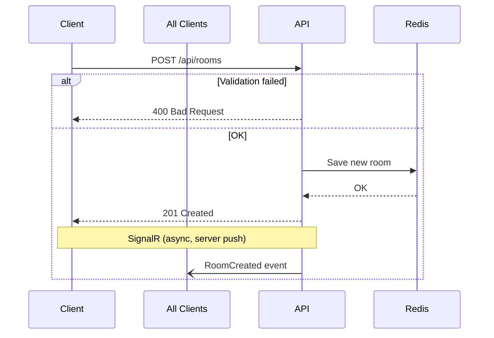
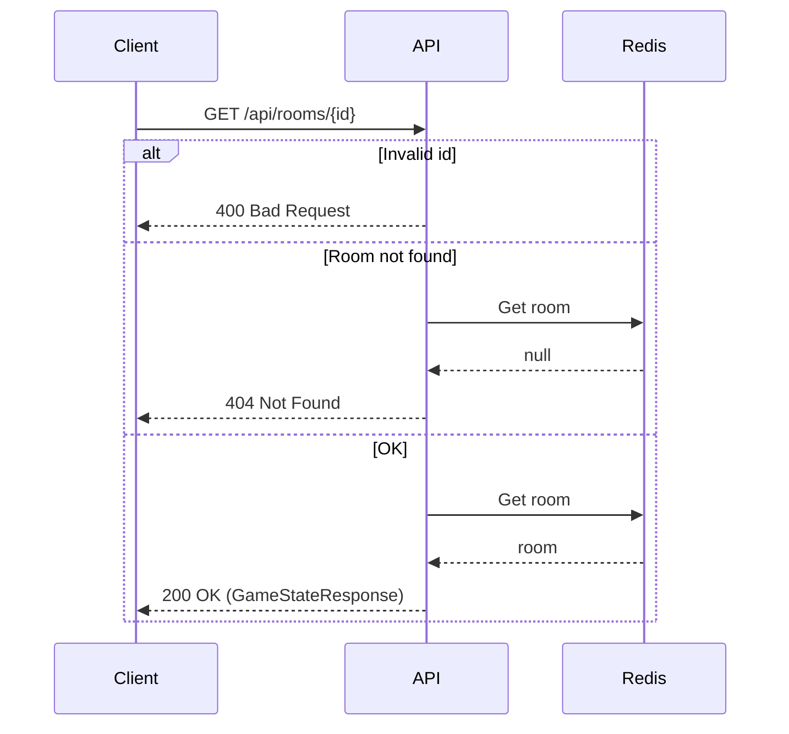
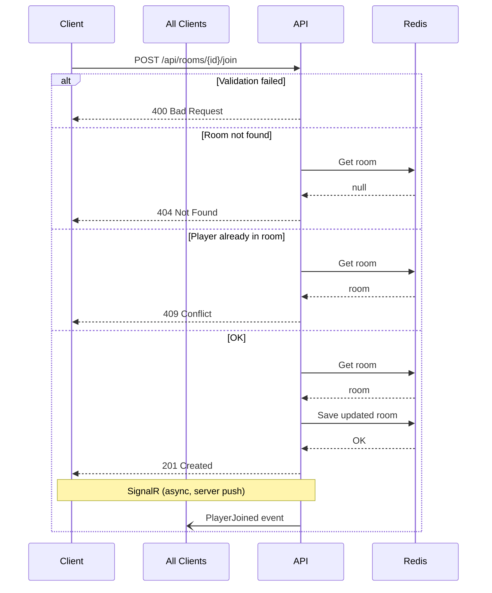
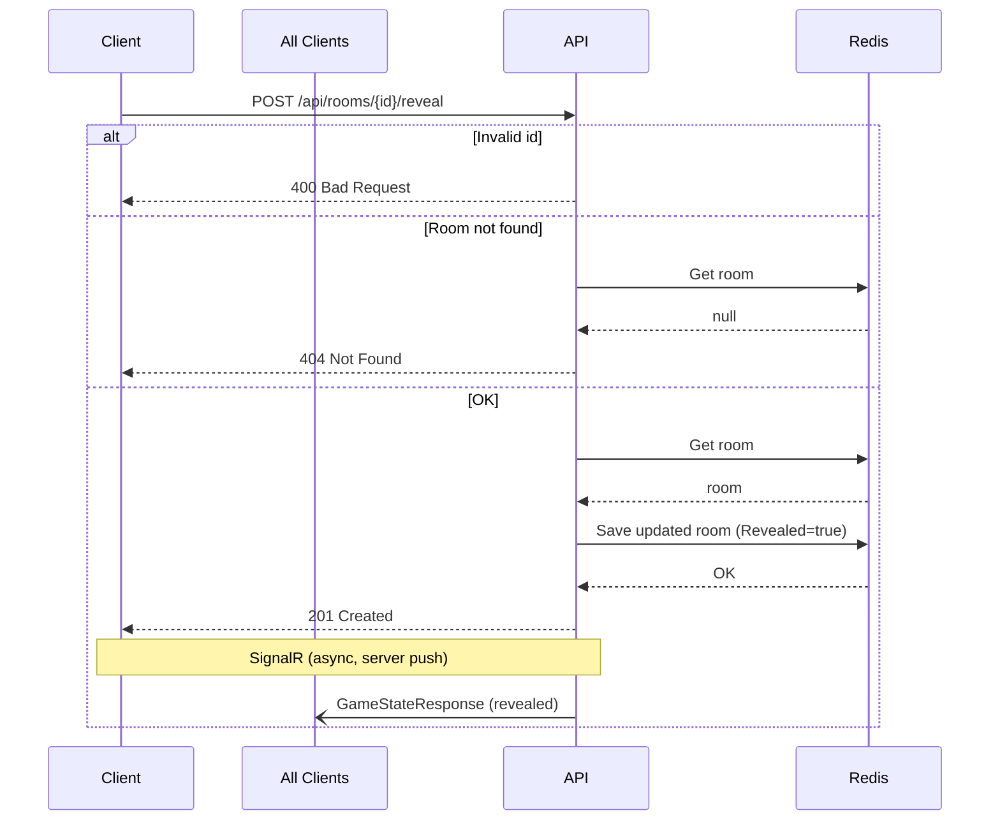
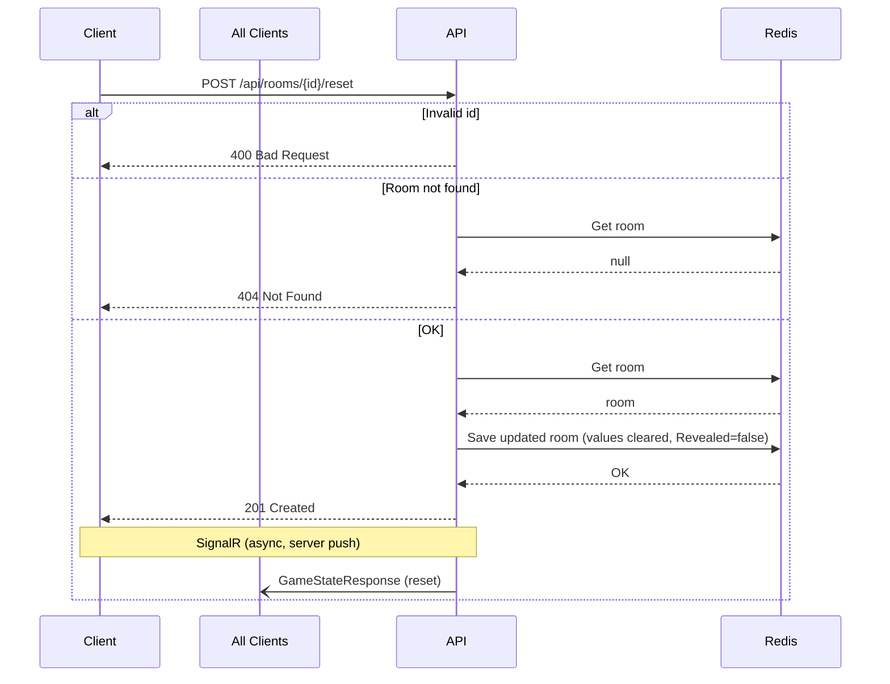
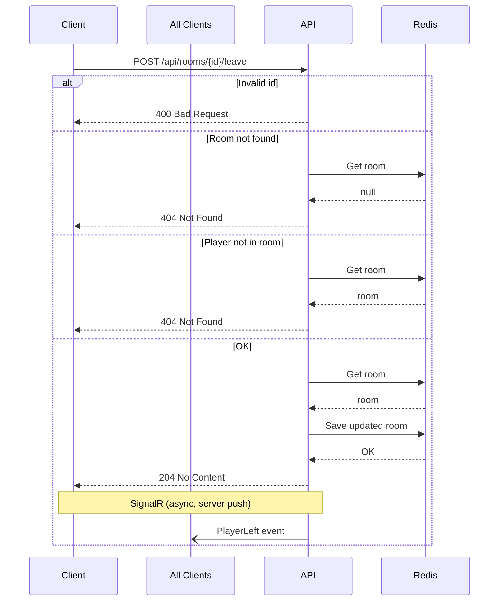

# Endpoints

All POST endpoints return status code only — no response body. `GET /api/rooms/{id}` returns the full game state. SignalR pushes full game state after every action.

---

## Endpoints Overview

| Endpoint | Method | Purpose |
|----------|--------|---------|
| `/api/rooms` | POST | Create a room |
| `/api/rooms/{id}` | GET | Get game state |
| `/api/rooms/{id}/join` | POST | Join a room |
| `/api/rooms/{id}/vote` | POST | Cast a vote |
| `/api/rooms/{id}/reveal` | POST | Reveal votes |
| `/api/rooms/{id}/reset` | POST | Reset votes |
| `/api/rooms/{id}/leave` | POST | Leave a room |
| `/api/hub` | WebSocket (SignalR) | Real-time events |
| `/health` | GET | Readiness probe |
| `/alive` | GET | Liveness probe |
| `/api/warmup` | GET | Startup probe |

---

## Interactive Testing

When running locally (dev mode), the API exposes **Swagger UI** at:

> **[/swagger](http://localhost:8080/swagger)**

Use it to explore endpoints and send test requests with auto-generated payloads.

---

## Validation Rules

| Field | Endpoints | Type | Rules |
|-------|-----------|------|-------|
| `id` (path) | All room endpoints | int | must be > 0 |
| `PlayerName` | Create, Join, Vote, Leave | string | required, max 50 chars |
| `Value` | Vote | string | required, must be one of the room's card set values |
| `CardSet` | Create | string[] | required, non-empty list of card values (e.g. `["0", "1", "2", "3", "5", "8", "13", "21", "?"]`) |

---

## Create Room

`POST /api/rooms`

Creates a new scrum poker room and adds the creator as the first player.

### Sequence



### CreateRoomRequest (body)

| Field | Type | Required | Rules |
|-------|------|----------|-------|
| PlayerName | string | yes | max 50 chars |
| CardSet | string[] | yes | non-empty list of card values, e.g. `["0", "0.5", "1", "2", "3", "5", "8", "13", "21", "?"]` |

| Status Code | Description |
|-------------|-------------|
| 201 | Room created. `Location` header contains room URL. |
| 400 | Validation failed |

---

## Get Game State

`GET /api/rooms/{id}`

Returns the current game state. Only GET endpoint that returns a response body.

### Sequence



### id (path)

| Field | Type | Required | Rules |
|-------|------|----------|-------|
| id | int | yes | must be > 0 |

### Response (200 OK)

```json
{
  "gameId": 1234,
  "players": {
    "Alice": "5",
    "Bob": null
  },
  "revealed": false,
  "cardSet": ["0", "0.5", "1", "2", "3", "5", "8", "13", "21", "?"]
}
```

| Status Code | Description |
|-------------|-------------|
| 200 | Room found |
| 400 | Invalid id |
| 404 | Room not found |

---

## Join Room

`POST /api/rooms/{id}/join`

Joins an existing room as a player.

### Sequence



### id (path)

| Field | Type | Required | Rules |
|-------|------|----------|-------|
| id | int | yes | must be > 0 |

### PlayerName (body)

| Field | Type | Required | Rules |
|-------|------|----------|-------|
| PlayerName | string | yes | max 50 chars |

| Status Code | Description |
|-------------|-------------|
| 201 | Joined successfully |
| 400 | Validation failed |
| 404 | Room not found |
| 409 | Player already in room |

---

## Vote

`POST /api/rooms/{id}/vote`

Casts a vote for the current round.

### Sequence


### id (path)

| Field | Type | Required | Rules |
|-------|------|----------|-------|
| id | int | yes | must be > 0 |

### VoteRequest (body)

| Field | Type | Required | Rules |
|-------|------|----------|-------|
| PlayerName | string | yes | max 50 chars |
| Value | string | yes | must be one of: `0, 0.5, 1, 2, 3, 5, 8, 13, 21, ?` |

| Status Code | Description |
|-------------|-------------|
| 201 | Vote recorded |
| 400 | Validation failed |
| 404 | Room not found or player not in room |

---

## Reveal Votes

`POST /api/rooms/{id}/reveal`

Reveals all votes in the current round.

### Sequence



### id (path)

| Field | Type | Required | Rules |
|-------|------|----------|-------|
| id | int | yes | must be > 0 |

| Status Code | Description |
|-------------|-------------|
| 201 | Votes revealed |
| 400 | Invalid id |
| 404 | Room not found |

---

## Reset Votes

`POST /api/rooms/{id}/reset`

Resets all votes for the next round.

### Sequence



### id (path)

| Field | Type | Required | Rules |
|-------|------|----------|-------|
| id | int | yes | must be > 0 |

| Status Code | Description |
|-------------|-------------|
| 201 | Votes reset |
| 400 | Invalid id |
| 404 | Room not found |

---

## Leave Room

`POST /api/rooms/{id}/leave`

Removes a player from the room.

### Sequence



### id (path)

| Field | Type | Required | Rules |
|-------|------|----------|-------|
| id | int | yes | must be > 0 |

### PlayerName (body)

| Field | Type | Required | Rules |
|-------|------|----------|-------|
| PlayerName | string | yes | max 50 chars |

| Status Code | Description |
|-------------|-------------|
| 204 | Player removed |
| 400 | Invalid id |
| 404 | Room not found or player not in room |

---

## SignalR Hub

`/api/hub`

### Client → Server

| Method | Parameter | Description |
|--------|-----------|-------------|
| JoinRoom | string roomId | Add connection to room group |
| LeaveRoom | string roomId | Remove connection from room group |

### Server → Client Events

All events carry the full game state payload (`{ gameId: int, players: Record<string, string | null>, revealed: boolean, cardSet: string[] }`).

| Event | Triggered by |
|-------|-------------|
| RoomCreated | POST /api/rooms |
| PlayerJoined | POST /api/rooms/{id}/join |
| PlayerVoted | POST /api/rooms/{id}/vote |
| VotesRevealed | POST /api/rooms/{id}/reveal |
| VotesReset | POST /api/rooms/{id}/reset |
| PlayerLeft | POST /api/rooms/{id}/leave |

---

## Health Checks

| Route | Purpose |
|-------|---------|
| GET /health | Ready probe (all checks must pass) |
| GET /alive | Liveness probe (tagged "live" only) |
| GET /api/warmup | Startup probe (creates + reads room to warm JIT and Redis) |
