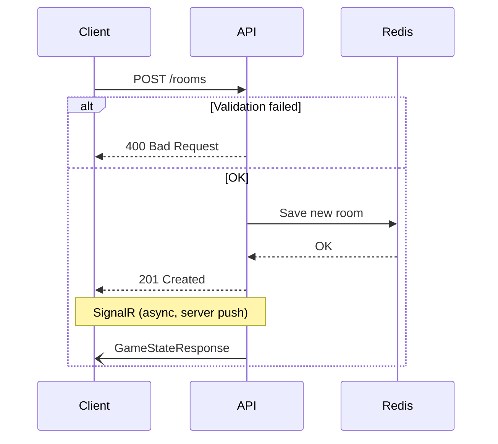
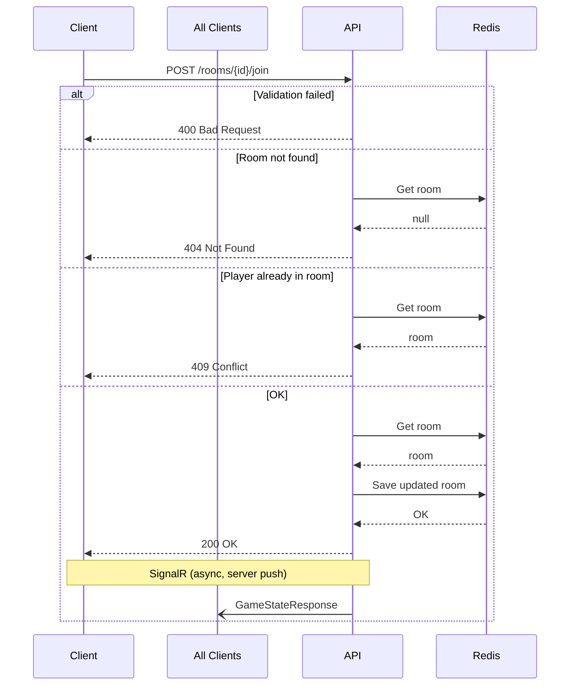

# Endpoints

## Create Room

`POST /rooms`

Creates a new scrum poker room and adds the creator as the first player.

### Sequence

### PlayerName (body)

| Field | Type | Required | Rules |
|-------|------|----------|-------|
| PlayerName | string | yes | max 50 chars |

| Status Code | Description |
|-------------|-------------|
| 201 | Room created |
| 400 | Validation failed |

## Join Room

### Sequence

`POST /rooms/{id}/join`

Joins an existing room as a player.

### id (path)

| Field | Type | Required | Rules |
|-------|------|----------|-------|
| id | int | yes | must be > 0 |

### PlayerName (body)

| Field | Type | Required | Rules |
|-------|------|----------|-------|
| PlayerName | string | yes | max 50 chars |

| Status Code | Description |
|-------------|-------------|
| 200 | Joined successfully |
| 400 | Validation failed |
| 404 | Room not found |
| 409 | Player already in room |

---
